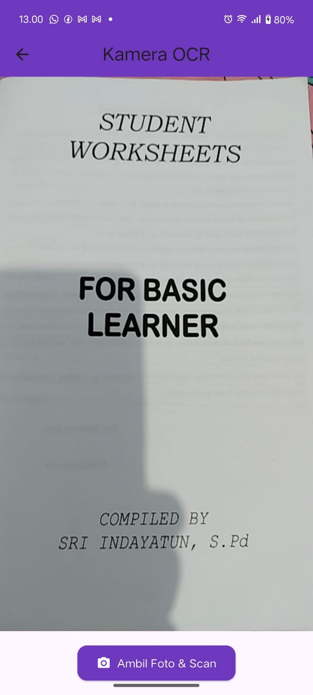
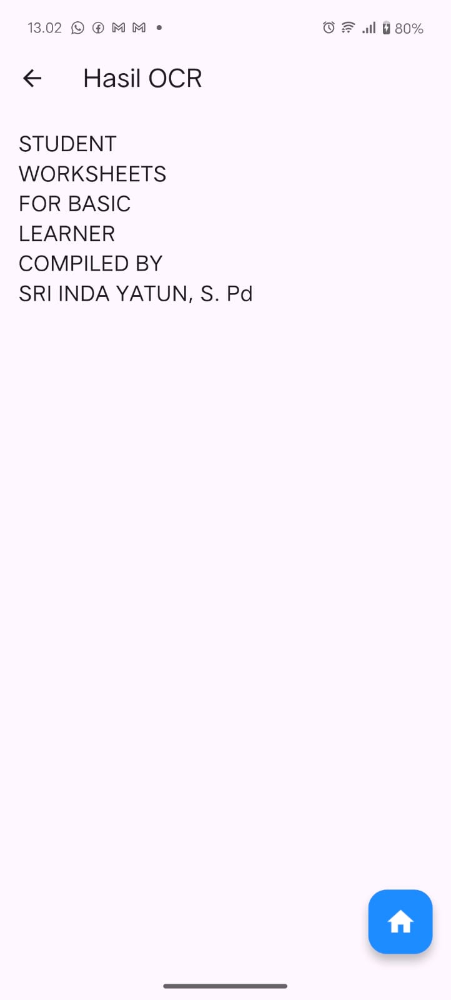
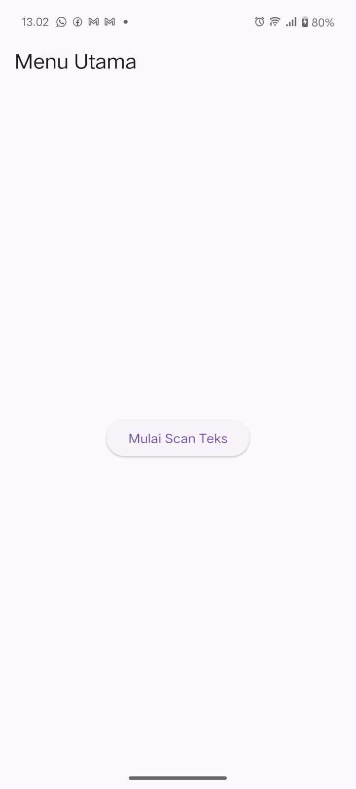
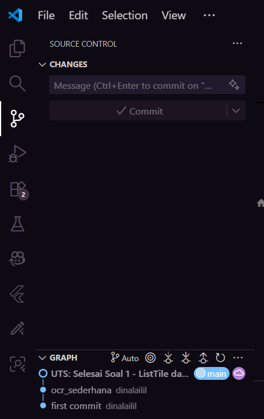
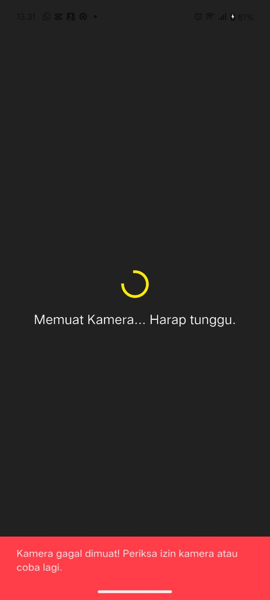
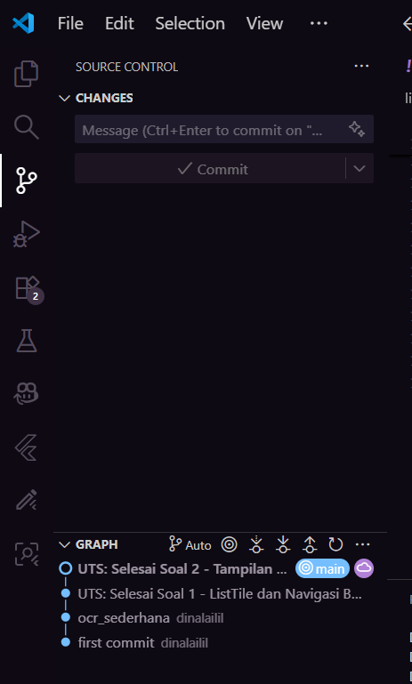
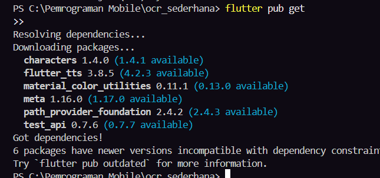
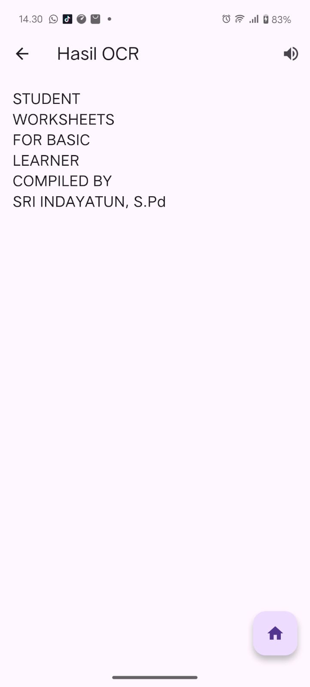
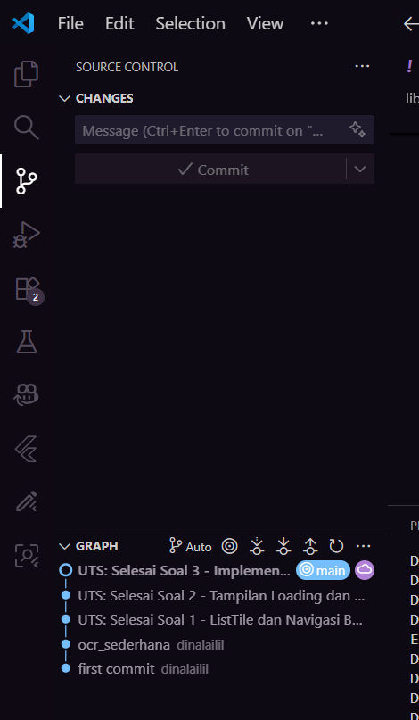

# OCR SEDERHANA

A new Flutter project.

---

## UJIAN TENGAH SEMESTER (UTS) - PRAKTIKUM

**Nama:** Dinarul Lailil Mubarokah
**Kelas:** SIB3C
**Mata Kuliah:** Pemrograman Mobile - Aplikasi OCR  
**Semester:** Ganjil  
**Tahun Akademik:** 2025/2026

---

##  Soal 1: Modifikasi Struktur Navigasi dan Aliran (30 Poin)

**Tujuan:**  
Menyederhanakan alur navigasi dan meningkatkan pengalaman pengguna di HomeScreen.

### 1. Pengubahan Navigasi Home (15 Poin)
- Ubah ElevatedButton di HomeScreen (lib/screens/home_screen.dart) menjadi *widget* **ListTile**.  
- Atur ListTile:  
  `leading: Icon(Icons.camera_alt, color: Colors.blue);`  
  `title: Text('Mulai Pindai Teks Baru');`  
- Fungsi onTap harus menggunakan `Navigator.push()` untuk ke **ScanScreen**.

### 2. Teks Utuh dan Navigasi Balik (15 Poin)
- Di ResultScreen (lib/screens/result_screen.dart), hapus fungsi `ocrText.replaceAll` agar hasil teks ditampilkan dengan baris baru (\n) yang utuh.  
- Tambahkan **FloatingActionButton** dengan ikon `Icons.home`.  
- Ketika tombol ditekan, navigasi harus kembali langsung ke HomeScreen menggunakan **Navigator.pushAndRemoveUntil()** (atau metode yang setara) untuk menghapus semua halaman di atasnya dari stack navigasi.

**OUTPUT:**
<div align="center">
  
  
  
  
</div>

---

##  Soal 2: Penyesuaian Tampilan dan Penanganan State/Error (40 Poin)

**Tujuan:**  
Memperbaiki tampilan *loading* dan memberikan *feedback* error yang lebih jelas.

### 1. Custom Loading Screen di ScanScreen (20 Poin)
- Di ScanScreen (lib/screens/scan_screen.dart), modifikasi tampilan *loading* yang muncul sebelum kamera siap (`if (!controller.value.isInitialized)`):
  - **Latar Belakang:** Scaffold(backgroundColor: Colors.grey[900]).
  - **Isi:** Di dalam Center, tampilkan Column berisi:
    ```dart
    CircularProgressIndicator(color: Colors.yellow);
    Text(
      'Memuat Kamera... Harap tunggu.',
      style: TextStyle(color: Colors.white, fontSize: 18),
    );
    ```

### 2. Spesifikasi Pesan Error (20 Poin)
- Di fungsi `_takePicture()` pada ScanScreen, modifikasi blok `catch (e)` untuk mengubah pesan *error* pada SnackBar.
- Pesan SnackBar harus berbunyi:  
  `"Pemindaian Gagal! Periksa Izin Kamera atau coba lagi."`  
  *(Hilangkan variabel error ($e)).*

**OUTPUT:**
<div align="center">
  
  
  
</div>

---

##  Soal 3: Implementasi Plugin Text-to-Speech (TTS) (30 Poin)

**Tujuan:**  
Mengintegrasikan fitur membaca teks secara lisan menggunakan *plugin* flutter_tts.

### 1. Instalasi Plugin (5 Poin)
- Tambahkan *plugin* `flutter_tts` ke dalam file **pubspec.yaml** (gunakan versi terbaru yang kompatibel).
- Jalankan perintah:
  ```bash
  flutter pub get

### 2. Konversi Widget dan Inisialisasi (10 Poin):
- Ubah ResultScreen dari StatelessWidget menjadi **StatefulWidget**. 
- Di initState(), inisialisasi FlutterTts dan atur bahasa pembacaan menjadi Bahasa Indonesia. 
- Implementasikan dispose() untuk menghentikan mesin TTS saat halaman ditutup.

### 3. Fungsionalitas Pembacaan (15 Poin): 
- Tambahkan FloatingActionButton kedua di ResultScreen (atau ganti AppBar dengan action button) dengan ikon Icons volume_up. 
- Ketika tombol ditekan, panggil fungsi speak() pada FlutterTts untuk membacakan seluruh isi ocrText. 

**OUTPUT:**
<div align="center">
  
  
  
  
</div>

## 🎬 Demo Video
### Video – Hasil Pembacaan Teks (TTS)
<video controls src="videos/video%201.mp4" title="Proses Pemindaian Teks" width="320"></video>
<video controls src="videos/video%202.mp4" title="Hasil Pembacaan Teks" width="320"></video>

