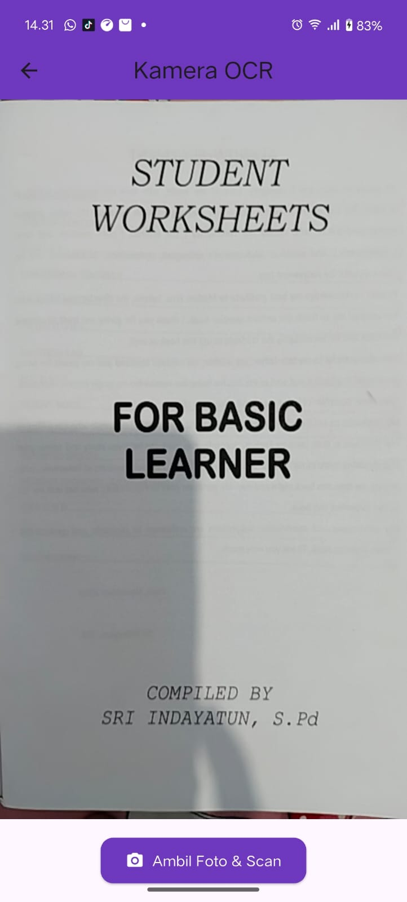

# ocr_sederhana

A new Flutter project.

## Getting Started

UJIAN TENGAH SEMESTER (UTS) - PRAKTIKUM
Mata Kuliah: Pemrograman Mobile - Aplikasi OCR Semester: Ganjil Tahun Akademik: 2025/2026

Soal 1:	Modifikasi Struktur Navigasi dan Aliran (30 Poin)
    Tujuan: Menyederhanakan alur navigasi dan meningkatkan pengalaman pengguna di
    HomeScreen.
    1.	Pengubahan Navigasi Home (15 Poin):
    •	Ubah ElevatedButton di HomeScreen (lib/screens/home_screen.dart) men- jadi *widget* **ListTile**.
    •	Atur ListTile: leading: Icon(Icons.camera_alt, color:	Colors.blue); title: Text(’Mulai Pindai Teks Baru’).
    •	Fungsi onTap harus menggunakan Navigator.push() untuk ke ScanScreen.
    2.	Teks Utuh dan Navigasi Balik (15 Poin):
    •	Di ResultScreen (lib/screens/result_screen.dart), hapus fungsi ocrText.replaceAll
    agar hasil teks ditampilkan dengan baris baru (\n) yang utuh.
    •	Tambahkan FloatingActionButton dengan ikon Icons.home.
    •	Ketika tombol ditekan, navigasi harus kembali langsung ke HomeScreen meng- gunakan **Navigator.pushAndRemoveUntil()** (atau metode yang setara) untuk menghapus semua halaman di atasnya dari stack navigasi.
    OUTPUT:
    
    
    
    

Soal 2: Penyesuaian Tampilan dan Penanganan State/Error (40 Poin)
    Tujuan: Memperbaiki tampilan *loading* dan memberikan *feedback* error yang lebih jelas.
    1.	Custom Loading Screen di ScanScreen (20 Poin):
    •	Di ScanScreen (lib/screens/scan_screen.dart), modifikasi tampilan *load- ing* yang muncul sebelum kamera siap (if (!controller.value.isInitialized)) :
    •	Latar Belakang:	Scaffold(backgroundColor:	Colors.grey[900]).
    •	Isi:	Di dalam Center, tampilkan Column berisi CircularProgressIndicator(col Colors.yellow).
    •	Di bawah indikator, tambahkan Text(’Memuat Kamera...	Harap tunggu.’, style:	TextStyle(color:	Colors.white, fontSize:	18)).
    2.	Spesifikasi Pesan Error (20 Poin):
    •	Di fungsi _takePicture() pada ScanScreen, modifikasi blok catch (e) un- tuk mengubah pesan *error* pada SnackBar.
    •	Pesan SnackBar harus berbunyi: "Pemindaian Gagal! Periksa Izin Kam- era atau coba lagi." (Hilangkan variabel *error* ($e)).
    OUTPUT:
    
    
    

Soal 3: Implementasi Plugin Text-to-Speech (TTS) (30 Poin)
    Tujuan:  Mengintegrasikan fitur membaca teks secara lisan menggunakan *plugin* flutter_tts.
    1.	Instalasi Plugin (5 Poin):
    •	Tambahkan *plugin* flutter_tts ke dalam file pubspec.yaml (gunakan versi terbaru yang kompatibel).
    •	Jalankan flutter pub get.
    2.	Konversi Widget dan Inisialisasi (10 Poin):
    •	Ubah ResultScreen dari StatelessWidget menjadi **StatefulWidget**.
    •	Di initState(), inisialisasi FlutterTts dan atur bahasa pembacaan menjadi Bahasa Indonesia.
    •	Implementasikan dispose() untuk menghentikan mesin TTS saat halaman ditutup.
    3.	Fungsionalitas Pembacaan (15 Poin):
    •	Tambahkan FloatingActionButton kedua di ResultScreen (atau ganti AppBar
    dengan action button) dengan ikon Icons.volume_up.
    •	Ketika tombol ditekan, panggil fungsi speak() pada FlutterTts untuk mem- bacakan seluruh isi ocrText.
    OUTPUT:
    
    
    
    

